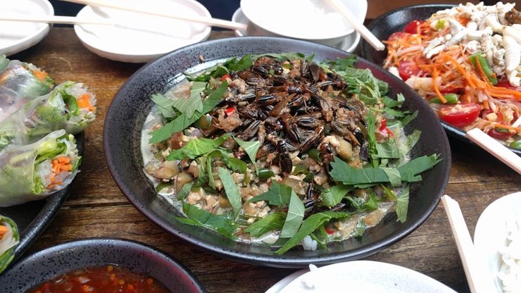

ガパオのコオロギ添え

2018年9月8日（土）に獣肉酒家「米とサーカス」で開催した「高田馬場で昆虫食を楽しむ会」で調理した料理です。

●材料（25人分、★は調味料）

コオロギ（フタホシコオロギ）・・・100匹（1人あたり4匹）

木綿豆腐・・・4丁

ピーマン・・・15個

ナス・・・10本（中1本目安80g）

大葉・・・20枚

ニンニク・・・1株

★しょうゆ・・・大さじ20

★砂糖・・・大さじ6

★酒・・・大さじ6

★ウスターソース・・・大さじ6

●作り方

1. コオロギを湯通しする。
2. 木綿豆腐を電子レンジに1～2分かけ、水を切り、手で一口大に崩す。
3. ピーマンとナスを1cm角に切り、大葉を5mm幅にスライスをする。
4. 唐辛子をぶつ切りにし、ニンニクを刻む。
5. ★（しょうゆ、砂糖、酒、ウスターソース）を混ぜ合わせる。
6. フライパンに油を入れ、（４）に火を通す。
7. （６）にナス、ピーマン、木綿豆腐を順に入れて炒める。
8. 野菜が馴染んできたら、★の調味料を回し入れ、味を付けながら炒め馴染んだら、皿に盛る。
9. 空いたフライパンで、コオロギをさっと炒める。
10. 盛ったお皿に、大葉、コオロギ（4匹ずつ）を添えて完成！

↓イベントの様子です。

※昆虫を初めて食べる際の注意

アレルギー症状がおこる場合があります。

エビ・カニなど甲殻類アレルギーをお持ちの方は、少量からお試しをお願いいたします。