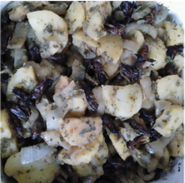

グリーンハーブとコオロギ炒めアライグマ風

グリーンハーブ料理と昆虫食のコラボレーションです。ハーブと昆虫の風味が絶妙に混ざり合っている一品です。

ご飯のおかずとして、お酒のおつまみとして、ぜひ作ってみてください！

●材料（4人分）

下茹でしたフタボシコオロギ・・・200匹

玉ねぎ・・・2個

ジャガイモ・・・・4個

料理酒・・・少々

塩・・・少々

乾燥野生のハーブ・・・適量

カキドオシ

サンショウ

ドクダミ

スギナ

ヨモギ

ニンニク etc.

オリーブオイル・・・適量

●作り方
1. 玉ねぎをみじん切りにし、ジャガイモは皮をむきスライスする。
2. フタホシコオロギを2分ほど下茹でする。
3. （２）で下茹でしたフタホシコオロギの水気を切る。
4. フライパンにオリーブオイルを入れ、（１）のジャガイモと玉ねぎを3分ほど炒める。
5. フライパンに塩とフタホシコオロギを入れて、1分ほど炒める。
6. フライパンに料理酒を少々入れて、蓋をして2分ほど蒸し焼きにする。
7. 蓋を開けて、ハーブを入れ全体にいきわたるよう混ぜてる。
8. 器に盛って完成！

※昆虫を初めて食べる際の注意

アレルギー症状がおこる場合があります。

エビ・カニなど甲殻類アレルギーをお持ちの方は、少量からお試しをお願いいたします。