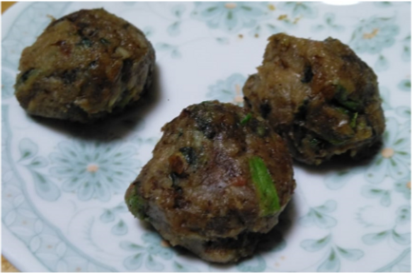

# コオロギと野草のみそ玉

戦国時代には戦飯としても重宝したと言われるみそ玉です。昆虫の風味も、食欲をそそりますね。

ハイキングやサバイバルゲームなどのお供に、是非作ってみてください！

# 材料（1人分）

アサツキ・・・適量

ミョウガ・・・新芽1つ

オニグルミ・・・6個

乾燥コオロギ粉（またはミキサーにかけた好きな昆虫）・・・適量

味噌・・・適量

カキドオシの葉・・・8枚

# 作り方
1. 味噌をオーブンで焼く。
2. 味噌の熱が取れたら、味噌以外の材料を投入する。
3. 味噌とそれ以外の具材を混ぜて、潰した後に、丸める。
4. （３）をおにぎりの具にしたり、水に溶いて冷や汁にしたりと、お好みでお召し上がりください！

※昆虫を初めて食べる際の注意

アレルギー症状がおこる場合があります。

エビ・カニなど甲殻類アレルギーをお持ちの方は、少量からお試しをお願いいたします。