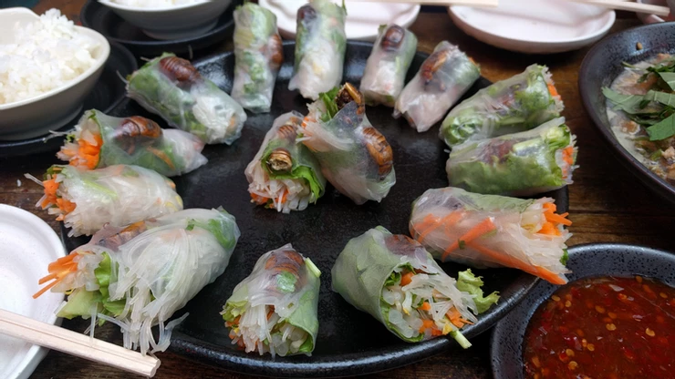

# セミ幼虫の生春巻き

2018年9月8日（土）に獣肉酒家「米とサーカス」で開催した「高田馬場で昆虫食を楽しむ会」で調理した料理です。

# 材料（25本分、★はソース）

セミ幼虫・・・50匹（1本あたり2匹）

春雨・・・80g

ニンジン・・・2本

パクチー・・・2株（お好みで）

もやし・・・2袋

サニーレタス・・・1個

ライスペーパー・・・25枚

★スイートチリソース・・・適量

# 作り方
1. セミ幼虫とモヤシを湯通しし、水気を切る。
2. 春雨を湯通ししたお湯に5～6分浸し、食べやすい長さに切る。
3. ニンジンを千切りにする。
4. サニーレタスを食べやすい大きさにちぎる。
5. パクチーを5mm程度に切る。
6. ライスペーパーを水にくぐらせる。
7. 水で戻したライスペーパーの上にサニーレタス、ニンジン、もやし、パクチー（お好みで）、春雨を乗せてきつめに巻き、両サイドを内側に織り込み、最後にセミ幼虫を2匹並べて巻き上げる。
※量は取りすぎないようにして巻く / セミ幼虫が外側に見えるようにする。
8. お好みで★ソース（チリソース）をつけて完成！

# その他
↓イベントの様子です。

※昆虫を初めて食べる際の注意

アレルギー症状がおこる場合があります。

エビ・カニなど甲殻類アレルギーをお持ちの方は、少量からお試しをお願いいたします。