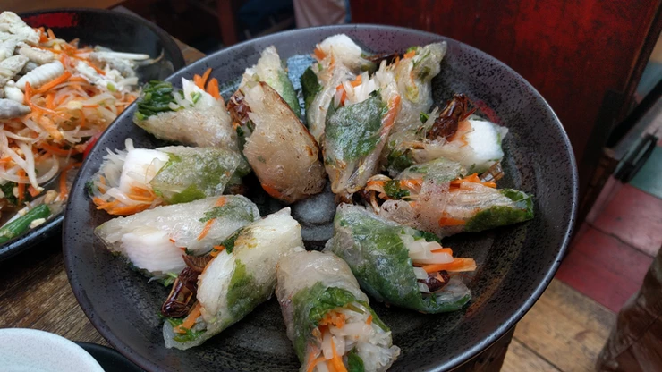

# タイワンツチイナゴの揚げ春巻き

2018年9月8日（土）に獣肉酒家「米とサーカス」で開催した「高田馬場で昆虫食を楽しむ会」で調理した料理です。

# 材料（25人分、★はソース）

タイワンツチイナゴ・・・2パック

春雨・・・80g

ニンジン・・・2本

パクチー・・・2株（お好みで）

もやし・・・2袋

長芋・・・1本

しその葉・・・25枚

ライスペーパー・・・25枚

サラダ油（揚げ用）

★スイートチリソース・・・適量

★ナンプラー・・・適量

# 作り方
1. イナゴはフライパンで乾煎りをした後に、脚を取り除く。
2. 春雨をお湯に5～6分浸し、食べやすい長さに切る。
3. ニンジンを千切りにする。
4. パクチーを5mm程度に切る。
5. 長いもの皮をむき、1cm程度の拍子切りにする。
6. ライスペーパーを水にくぐらせて戻す。
7. ライスペーパーの上にしその葉、イナゴ、ニンジン、もやし、長芋、パクチー（お好みで）、春雨を乗せて、きつめに巻き、両サイドを内側に織り込む。
8. フライパンに油を入れて160度に温める。
※油の量は、生春巻きが浸る程度で良い。
9. 油が十分温まったら、生春巻きを揚げる。
10. 油に浸っている春巻きの面がカリッとしてきたら、菜箸で転がす。
11. 春巻きが全体的にきつね色になったら、油から上げる。
12. ★ソース（チリソース、ナンプラー）を付けて完成！

# その他
↓イベントの様子です。

※昆虫を初めて食べる際の注意

アレルギー症状がおこる場合があります。

エビ・カニなど甲殻類アレルギーをお持ちの方は、少量からお試しをお願いいたします。

