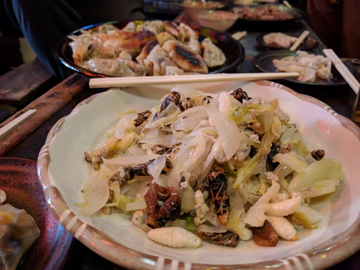

# タガメ風味のザワークラウド　スズメバチ＆サゴヤシゾウムシ和え

2018年1月13日（土）に獣肉酒家「米とサーカス」で開催した「高田馬場で昆虫食を楽しむ会」で調理した料理です。

2種類のスズメバチとサゴヤオオゾウムシを同時に味わうことができる、満足度の高い一品です！

# 材料（20人分）

キイロスズメバチ（巣抜き）・・・100g

オオスズメバチ（巣ごと）・・・1巣

サゴヤオオゾウムシ・・・40匹

タガメ香料・・・1箱

キャベツ・・・半玉

玉ねぎ・・・1玉

酢・・・大さじ4 +適量

砂糖・・・大さじ2

# 作り方
1. オオスズメバチを巣からピンセットで抜いて、すでに抜いてあるキイロスズメバチと合わせる。
※幼虫は事前にフン抜きをすること。
2. キャベツを1cm幅の細切り、玉ねぎをくし切りにする。
3. （１）を茹でる。
4. （３）を酢に浸しておく。
5. フライパンに（２）と（４）、サゴヤシオオゾウムシの乾物、砂糖大さじ2、酢大さじ4を加え、軽く炒めて中火のまま蓋をして蒸す（15分ほど適宜混ぜながら蒸す）。
6. キャベツがしんなりしてきたら、香りづけにタガメ香料を加えて完成！

# その他

※昆虫を初めて食べる際の注意

アレルギー症状がおこる場合があります。

エビ・カニなど甲殻類アレルギーをお持ちの方は、少量からお試しをお願いいたします