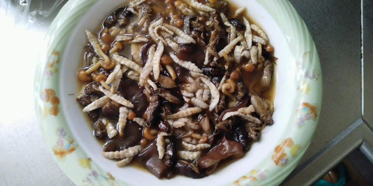

# タケツトガとコオロギの餡掛け

映画イクジステンスのスペシャルがありますが、それを両生類の餡掛け料理を昆虫で復活させました！

●材料（2人分、★は餡の材料）
タケツトガ・・・6g
コオロギ・・・6g
ナメコ・・・10g
キクラゲ・・・10g
油・・・大さじ3
★片栗粉・・・大さじ1
★酒・・・大さじ1
★醤油・・・大さじ1
★砂糖・・・小さじ1
★鶏ガラスープ・・・大さじ1
★オイスターソース・・・大さじ1
★酢・・・小さじ2
★水・・・200cc

# 作り方
1. 餡の材料を混ぜる。
2. フライパンに油をしき、虫（タケツトガとコオロギ）を2分ほど炒める。
3. （２）にキノコ（ナメコとキクラゲ）を投入し、中火で3分ほど炒める。
4. 火を止めて（３）に餡を入れて、全体に馴染ませる。
5. （４）を中火で沸騰させる。餡がとろとろになる状態が目安。
6. 火を止めて、沸騰の泡が出なくなったら完成！

# その他

アジア圏は多様な生物の宝庫ゆえに、食材の選択肢が欧米より豊富な傾向があります。
使う生物も豊富ゆえに外国人からは奇妙なものもまたしかりです。

※昆虫を初めて食べる際の注意
アレルギー症状がおこる場合があります。
エビ・カニなど甲殻類アレルギーをお持ちの方は、少量からお試しをお願いいたします。
