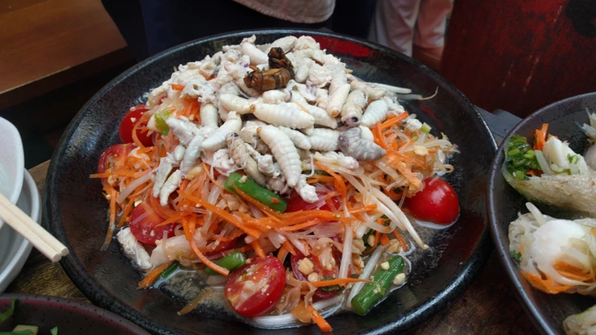

# ハチの子入りソムタム

2018年9月8日（土）に獣肉酒家「米とサーカス」で開催した「高田馬場で昆虫食を楽しむ会」で調理した料理です。

# 材料（25人分、★は調味料）

スズメバチ（ハチの子）（巣抜き）・・・200g

ピーナッツ・・・1袋（100ｇ）

ニンジン・・・4本

いんげん・・・20本

ミニトマト・・・1パック（20個）

ニンニク・・・1株

生唐辛子・・・4本（お好みで調整）

★ナンプラー・・・大さじ3

★レモン汁・・・大さじ3

★砂糖・・・大さじ2

# 作り方
1. 巣からスズメバチ幼虫・さなぎをピンセットで抜いて、茹でる。
2. いんげんを湯通しして水気を切り、3cm程度に切る。
3. ニンジンの皮をむいて千切りにする。
4. ミニトマトを縦半分に切る。
5. ボールにピーナッツ、赤唐辛子、ニンニクを入れて軽く潰す。
6. （５）に★の調味料（ナンプラー、レモン汁、砂糖）を入れて、よく混ぜ合わせる。
7. （５）にハチの子、ピーナッツ、ニンジン、インゲン、ミニトマトをいれて味をなじませて完成！

# その他
↓イベントの様子です。

※昆虫を初めて食べる際の注意

アレルギー症状がおこる場合があります。

エビ・カニなど甲殻類アレルギーをお持ちの方は、少量からお試しをお願いいたします。