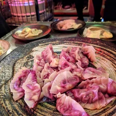

# 蟲ピエロギ3種

2018年1月13日（土）に獣肉酒家「米とサーカス」で開催した「高田馬場で昆虫食を楽しむ会」で調理した料理です。

アリ、ハチ、コオロギの3種類の蟲（むし）を使ったポーランドの国民食「ピエロギ」のレシピを、一挙大公開です！

# アリの子ジャム入り

●材料（20人分）

アリの子・・・2缶

ジャム・・・1瓶

チーズ・・・6ピース

餃子の皮・・・20枚

片栗粉・・・少々

水・・・少々

## 作り方

1. アリの子を茹でる。
2. チーズを一口大にちぎる。
3. （１）と（２）、ジャムを餃子の皮の真ん中にのせる。目安は「アリの子：小さじ1/2、ジャム：小さじ1/2」。
4. 餃子の皮の外側に、水溶き片栗粉を塗り、半分に折りひだを作りながら軽く押さえたあと、フォークで閉じる。※空気が入らないようにすること。

5. （４）を熱湯で茹で、餃子が浮いてから3分ほど茹でたら完成！

# ハチの子ジャム入り
●材料（20人分）

クロスズメバチ幼虫・さなぎ（巣抜き）・・・150ｇ

クロスズメバチ幼虫・さなぎ（巣ごと）・・・1巣

ジャム・・・1瓶

チーズ・・・6ピース

餃子の皮・・・20枚

片栗粉・・・少々

水・・・少々

## 作り方
1. 巣からクロスズメバチ幼虫・さなぎをピンセットで抜いて、巣抜きのクロスズメバチと合わせ、茹でる。
2. チーズを一口大にちぎる。
3. （１）と（２）、ジャムを餃子の皮の真ん中にのせる。目安は「クロスズメバチ：小さじ1/2　ジャム小さじ1/2」。
4. 餃子の皮の外側に、水溶き片栗粉を塗り、半分に折りひだを作りながら軽く押さえたあと、フォークで閉じる。※空気が入らないようにすること。
5. （４）を熱湯で茹で、餃子が浮いてから3分ほど茹でたら完成！

※写真は撮り忘れてしまいました...

# コオロギ＆地蜂の炒め入り
## 材料（20人分、★はソース）

コオロギ・・・40匹

クロスズメバチ成虫・・・30ｇ　　

玉ねぎ・・・2玉

キャベツ・・・半玉

バター・・・2欠片

塩・・・少々

餃子の皮・・・20枚

★玉ねぎ・・・1玉

★醤油・・・50cc

★みりん・・・50cc

★バター・・・1欠片

## 作り方
1. 玉ねぎ2玉、キャベツ半玉を粗みじん切りにする。
2. コオロギを素揚げする。
3. （１）と（２）、クロスズメバチ成虫をバターで炒め、適宜塩コショウで味を調える。
4. 炒めた（３）を餃子の皮の真ん中にのせる。目安は「クロスズメバチ成虫：5匹　コオロギ：3匹」。
5. 餃子の皮の外側に、水溶き片栗粉を塗り、半分に折りひだを作りながら軽く押さえたあと、フォークで閉じる。※空気が入らないようにすること。
6. 餃子を焼く要領で焼き、途中水を入れ蒸し焼きにする。
7. 皿に盛り、ソースをかけたら完成！

## 作り方（ソース）
1. 玉ねぎ1玉を粗みじん切りにする。
2. （１）をバターできつね色に色づくまで炒め、醤油とみりんを加え軽く煮立たせる。

# その他

※昆虫を初めて食べる際の注意

アレルギー症状がおこる場合があります。

エビ・カニなど甲殻類アレルギーをお持ちの方は、少量からお試しをお願いいたします。